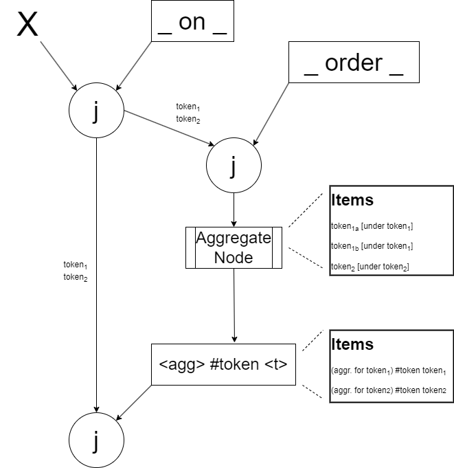

# Aggregates in Rete
## Plain Rete infrastructure
Support for aggregates has been added by re-using the existing machinery of the Rete, arranged in a configuration 
reminiscent of how negation is implemented using the NccNode. In the same vein, the aggregate is added as a
pseudo-condition, but in contrast to an NCC, where it only reserves a place for a dummy WME in the token (to avoid
messing up with token traversal), this condition causes a WME with the aggregate value to appear in the token.

In contrast to how calculations for arithmetic conditions where implemented inside the library, support for aggregates
is defined using programming artifacts. This does not preclude some such implementation in the future.

## Walkthrough
Let's take one of the productions in the corresponding tests as an example:

`(<x> on <y>),(<cn> <- #SUM(<c>)) from {(<y> order <c>)} ⇒  prod1`

The second condition is an aggregate condition that will cause variable `cn` to hold the sum of all values of `c`
from the condition set inside braces.

Like in NCC syntax, the braces can hold any number of conditions. Like in NCC implementation, these conditions live
in a branch of the Rete underneath the previous conditions of the production, and the resulting tokens are operated
upon by a special beta memory, called an AggregateNode. The AggregateNode is coordinating with a special alpha
memory that holds the current values of the aggregate for each owner token for the tokens maintained by the 
AggregateNode. The owner token is the token, excluding the part that is within in aggregate branch. Essentially, the
tokens are grouped by the owner tokens and the aggregate is computed on the set corresponding to each owner token,
as this set changes. This is depicted in the following chart.

Let us see how this plays out with an example. We have WME `(B1 on B2)`. If we add WME `(B2 order 1200)`, the AggregateNode
receives token `((B2 order 1200)->(B1 on B2))`, whose owner token is `((B1 on B2))`. The special alpha memory that is
coupled with this AggregateNode receives WME `(1200 #token ((B1 on B2)))`, after which the join node that sits next to
the branch for the AggregateNode, joining the beta memory that has token `((B1 on B2))` and that alpha memory, triggers
the production with the token `((1200 #token ((B1 on B2)))->(B1 on B2))`.

When WME `(B2 order 800)` is added, the token `((B2 order 800))->(B1 on B2))` arrives at the AggregateNode. In turn, it
removes the old WME for the owner token from the special alpha memory, `(1200 #token ((B1 on B2)))` which cascades and
undoes the previous production, and then adds the current one, `(2000 #token ((B1 on B2)))`. The production ends up
being triggered by the token `((2000 #token ((B1 on B2)))->(B1 on B2))`.

## The AggregateComputation abstract class
The base class for all implementations of aggregates is an abstract class, `AggregateComputation`. This class
specifies the following operations that every implementation should offer:

    abstract variables(): string[];
    abstract init(): T;
    abstract mapper(map: StringToStringMap): T;
    abstract reducer(v1: T, v2: T): T;
    finalizer(v: T): string { return (v as any).toString(); }

and one value that is injected by the library while compiling the conditions:

    locationInToken: LocationsOfVariablesInConditions = {};

Method `variables` is meant to inform the library of which variables in the token are used by the aggregate.

Method `mapper` is given a map with values for each variable, in a token, and is supposed to compute a 
value for this token.

Method `reducer` is the commutative operation that combines two values.

Method `init` gives the "zero" element of the "reducer".

Method `finalizer` may perform some final computation on the resulting value. Defaults to just returning it.
