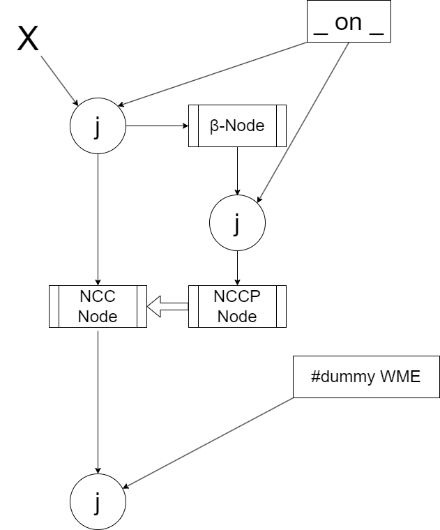

# Rete-Next

Implementation of RETE, based on the C++ implementation in https://github.com/bollu/rete.
That was based in the exposition of basic Rete in [Robert B. Doorenbos' PhD Thesis: Production Matching for Large Learning Systems](http://reports-archive.adm.cs.cmu.edu/anon/1995/CMU-CS-95-113.pdf).
The original state of this project was a failthful transcription of that implementation
in TypeScript.

## Enhancements
### Tests
The original 'tests' were rewritten as real Unit tests in Mocha.

### Intra-condition tests
The original implementation lacked intra-condition tests (repetition of the same variable within the same condition)
and this was added.

### Partial matches
The original implementation only supported full matches. An operation was added
to retrieve partial matches (initial version exists).

### Arithmetic tests
The ability to do arithmetic tests between variables, intra-condition, or across conditions, was added. It is the Inference
Engine's responsibility to classify arithmetic tests into intra-condition or across-condition tests. Comparison is
lenient, to an accuracy of 1e-6.

### Equality tests
As a special case, when a test involves equality comparisons, (□ = □) or (□ <> □), and both operands evaluate to symbols,
the test is done between symbols and not arithmetically.

### Removal of WMEs
A re-match based implementation of WME removals was added.

### Fuzzy inference
For working with fuzzy sets, the concept of a Fuzzy Variable has been added. See [here](./README-fuzzy.md).

### NCCs (Negated Conjunctive Conditions)
An implementation of negated conjunctive conditions has been added, based on the ideas in the Doorenbos thesis. 
It was reimplemented to work with re-match based removals. The syntax is `-{cond1, cond2...}`. It is 
implemented using two coordinated classes, `NccNode` and `NccPartnerNode`, both deriving from `BetaMemory`.
The token was extended to hold two fields.

```typescript
  owner: Token | null = null;
  nccResults: Token[] | null = null;
```

The `NccPartnerNode` groups and keeps tokens that have the same token, as the one entering the
`NccNode`, as an ancestor. The `NccNode` releases its tokens only so long as the `NccPartnerNode`
does not have any "negative" tokens for it. This is depicted in the followin image.



### "Truth Maintenance"
A TMS is a separate module from the matcher, but a simple implementation  of what it entails for WME additions 
can be found in the test [truth-maint.spec.ts](./spec/truth-maint.spec.ts). It might evolve
into a helper library, but it's really simple and perhaps not worth it. Keep in mind that cycles are not detected by
this simple implementation.

For each WME that is added by one or more productions, a list of "justifications" is maintained. A justification is a 
token that was produced, and the name of the production. Whenever a production removes a previously produced token,
the corresponding justification is removed from the WME. When a WME no longer has any justification, it is retracted,
causing the same logic to take effect for other productions, perhaps.

### Nested Search Contexts
Given a knowledge base, one might need to explore various hypotheses. These hypotheses can be tried out, validated, and
perhaps refuted. This activity creates a _Search Space_. This is explained in more detail [here](./README-nested.md).


### Removal of productions
Removal of productions was added, taking into account NCC nodes and NCC partner nodes as well.

### Querying
A simple querying facility was added, using a transiently added production.

### Aggregates
Support for computing aggregates has been added. This is explained in more detail [here](./README-agg.md).

### Conditions written in Cypher
The parser has been extended to create conditions in Cyper (graph database query language). This is explained 
in more detail [here](./README-cypher.md).

### Reified relations were added to support property graphs
Property graphs support relationships having properties. To allow Rete-Next to be used with knowledge bases coming
from property graphs (see section on Cypher), one small addition was done: the ability of a Condition to assign a
WME to a variable. 

Let us look at the production `( (<x> rel <y>) as <r> (<r> date <d>) -> "prod1")`. Note the suffix of 
`(<x> rel <y>)` which assigns the whole WME it matches to variable `<r>`. It is this mechanism that allows the 
relation to have properties, because the WME can be used as an atom inside other WMEs. If you look at the relevant
test, the operation looks like this:

```typescript
      const wme = rete.add('a', 'rel', 'b');
      rete.add(wme, 'date', '2024-09-30');
```

### Positive Conjunctive Conditions
The counterpart to Negative Conjunctive Conditions, Positive Conjunctive Conditions are true when the constituent
conditions can match the knowledge base. The difference between listing them after the preceding conditions is that,
in that case, each distinct match results in a different token, all of them having the initial token as an
ancestor. While, with the PCC, once one or more matches follow from the initial token, a single descendant token is
produced. The syntax is `+{cond1, cond2...}`. It is implemented using a special `AggregateComputation`
class, `AggregateExist`, together with a special join test, `ExistTest`.

### Fact assertions
Two syntaxes were added to the grammar, both producing constrained Condition objects that are used to encode WMEs.

#### Native syntax
The native syntax is as follows:
```
(! (foo is-a Person)
   (foo SubjectOf bar)
   (bar is-a King)
   (foo TaughtBy mrjones) as <_11>
   (<_11> level primary)
   (mrjones is-a Teacher)
)
```

Method `addWMEsFromConditions` adds these Conditions, translating them to WMEs and resolving WME variables. Read the 
following paragraph to learn about other variables that can be used in this syntax.

The clause above results in the following WMEs added:

```
(foo TaughtBy mrjones)
((foo TaughtBy mrjones) level primary)
(foo is-a Person)
(foo SubjectOf bar)
(bar is-a King)
(mrjones is-a Teacher)
```

#### Cypher INSERT
A Cypher INSERT clause reads as follows:

```
create (n:Person )-[:SubjectOf]->(:King), (n)<-[:TaughtBy {level: "primary"}]-(:Teacher)
```

This syntax is parsed as if it were the following native syntax:

```
(! (<n> is-a Person)
   (<n> SubjectOf <_9>)
   (<_9> is-a King)
   (<n> TaughtBy <_10>) as <_11>
   (<_11> level primary)
   (<_10> is-a Teacher)
)
```

The variables that you see that are not WME variables, are substituted by fresh symbols of the form `gensym-NNNN`.

The clause above results in the following WMEs being added (gensym numbers are arbitrary):

```
(gensym-239 TaughtBy gensym-241)
((gensym-239 TaughtBy gensym-241) level primary)
(gensym-239 is-a Person)
(gensym-239 SubjectOf gensym-240)
(gensym-240 is-a King)
(gensym-241 is-a Teacher)
```
